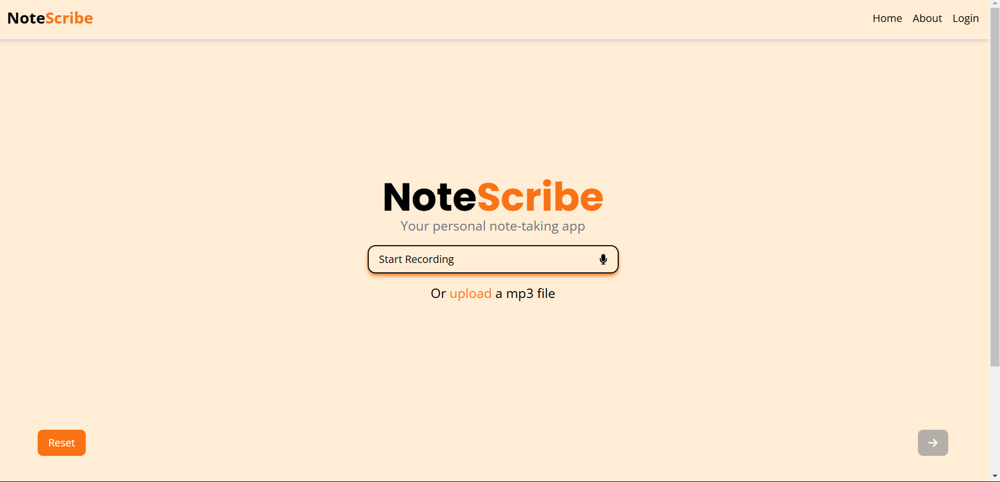

# NoteScribe



A web-tool using AI to transcribe and translate from audio/speech to text.

**Link to project:** [NoteScribe](https://notetranscribe.vercel.app/)


## 🚀 About me
Hi, I'm Huy Phung – the sole developer behind NoteScribe, a project inspired by my passion for coding and simplifying everyday tasks through technology.

NoteScribe was created to address the need for a simple, accessible, and feature-rich tool to manage voice notes. From students and professionals to anyone needing efficient note management, this app aims to streamline the process of capturing and organizing audio recordings.

Whether you're recording a lecture, a meeting, or your personal thoughts, NoteScribe provides an all-in-one platform to transcribe, translate, and manage your notes with ease.

## 🌟 Highlights:
- **Audio Transcription:** Automatically transcribe recorded or uploaded audio files into text with high accuracy
- **Multiple Language Support:** Transcribe audio in various languages and translate transcriptions into over 50 languages.
- **File Upload for Transcription:** Upload pre-recorded audio files for quick and accurate text conversion.
- **Export Transcriptions:** Save transcribed text as documents or copy them for future use.
- **Audio Playback with Text Syncing:** Review audio and synced text side by side for seamless editing and note-taking.

## 👷 Built With:

* [![React][React.js]][React-url]
* [![Tailwind CSS][TailwindCSS]][TailwindCSS-url]
* [![Headless UI][HeadlessUI]][HeadlessUI-url]
* [![Vite][Vite]][Vite-url]
* [![FontAwesome][FontAwesome]][FontAwesome-url]
* [![Node.js][Node.js]][Node-url]
* [![Express.js][Express.js]][Express-url]
* [![MongoDB][MongoDB]][MongoDB-url] 
* [![AWS S3][AWS-S3]][AWS-S3-url]
* [![JWT][JWT]][JWT-url]
* [![Vercel][Vercel]][Vercel-url]

## 📝 Getting Started 
To get a local copy up and running follow these simple steps.

### Prerequisites

Make sure you have the following installed on your local machine:
* Node.js
* npm (Node Package Manager)

### Installation

1. Clone the repo
    ```sh
    git clone https://github.com/your-username/notescribe.git
    ```
2. Navigate to the project directory
    ```sh
    cd notescribe
    ```
3. Install NPM packages
    ```sh
    npm install
    ```
4. Start the development client and server
    ```sh
    npm run dev
    ```

### Usage

1. Open your browser and navigate to `http://localhost:5173`
2. Upload an audio file or record a new one to start transcribing.


## Future Enhancement Roadmap:
- [ ] Dark mode/ System mode
- [ ] User Authentication and Authorization
    - [x] JWT
    - [x] Role-Based Access Control (RBAC)
    - [ ] OAuth 2.0
    - [ ] Multi-Factor Authentication (MFA)
- [x] Responsiveness with mobile view
- [x] Integration with Cloud Storage Services
- [ ] Enhanced Security Features
    - [ ] Data Encryption at Rest and in Transit
    - [ ] Regular Security Audits and Penetration Testing
    - [ ] Secure API Endpoints with Rate Limiting
    - [ ] Implement Content Security Policy (CSP)
- [ ] Customizable Transcription Settings
    - [ ] Transcription Accuracy Levels
    - [ ] Timestamp Insertion
- [ ] Advanced Analytics and Reporting (Admin Dashboard)
    - [ ] Usage Statistics
    - [ ] User Behavior Analysis
    - [ ] Performance Reports
    - [ ] Custom Reports


## 🤝 Contributing

Contributions are what make the open source community such an amazing place to learn, inspire, and create. Any contributions you make are **greatly appreciated**.

If you have a suggestion that would make this better, please fork the repo and create a pull request. You can also simply open an issue with the tag "enhancement".
Don't forget to give the project a star! Thanks again!

1. Fork the Project
2. Create your Feature Branch (`git checkout -b feature/AmazingFeature`)
3. Commit your Changes (`git commit -m 'Add some AmazingFeature'`)
4. Push to the Branch (`git push origin feature/AmazingFeature`)
5. Open a Pull Request

<!-- LICENSE -->
## 📃 License

Distributed under the MIT License.

<!-- CONTACT -->
## 🗨️ Contact

Huy Phung - huyphung3103@gmail.com

Project Link: [https://github.com/hphng/NoteScribe](https://github.com/hphng/NoteScribe)

[Vite]: https://img.shields.io/badge/Vite-646CFF?style=for-the-badge&logo=vite&logoColor=white
[Vite-url]: https://vitejs.dev/
[FontAwesome]: https://img.shields.io/badge/Font_Awesome-339AF0?style=for-the-badge&logo=fontawesome&logoColor=white
[FontAwesome-url]: https://fontawesome.com/
[React.js]: https://img.shields.io/badge/React-20232A?style=for-the-badge&logo=react&logoColor=61DAFB
[React-url]: https://reactjs.org/
[Node.js]: https://img.shields.io/badge/Node.js-43853D?style=for-the-badge&logo=node.js&logoColor=white
[Node-url]: https://nodejs.org/
[Express.js]: https://img.shields.io/badge/Express.js-404D59?style=for-the-badge
[Express-url]: https://expressjs.com/
[MongoDB]: https://img.shields.io/badge/MongoDB-4EA94B?style=for-the-badge&logo=mongodb&logoColor=white
[MongoDB-url]: https://www.mongodb.com/
[Vercel]: https://img.shields.io/badge/Vercel-000000?style=for-the-badge&logo=vercel&logoColor=white
[Vercel-url]: https://vercel.com/
[TailwindCSS]: https://img.shields.io/badge/Tailwind_CSS-38B2AC?style=for-the-badge&logo=tailwind-css&logoColor=white
[TailwindCSS-url]: https://tailwindcss.com/
[HeadlessUI]: https://img.shields.io/badge/Headless_UI-1F2937?style=for-the-badge&logo=headlessui&logoColor=white
[HeadlessUI-url]: https://headlessui.dev/
[JWT]: https://img.shields.io/badge/JWT-000000?style=for-the-badge&logo=JSON%20web%20tokens&logoColor=white
[JWT-url]: https://jwt.io/
[AWS-S3]: https://img.shields.io/badge/Amazon_S3-569A31?style=for-the-badge&logo=amazonaws&logoColor=white
[AWS-S3-url]: https://aws.amazon.com/s3/
